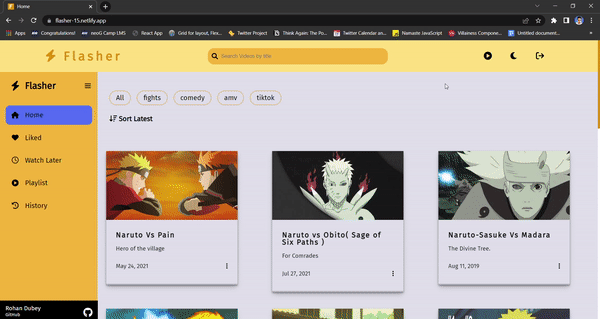

<div align="center">
  
  
# Flasher
  A Video Library Web App based on Naruto - Anime
</div>

---
## Live Deployment

Checkout the live website [here](https://flasher-15.netlify.app/)

---
## **How to install and run locally ?**

```
$ git clone https://github.com/rohan-154/flasher-video-library
$ cd flasher-video-library
$ yarn install
$ yarn start
```
---
## **Features -**

- Home Page
- Video Listing Page with all the videos listed
- Filter Videos with category names
- Search Videos based on the title of the video
- Sort Videos as recent videos
- Single Video Page with like, watch later and create playlist options.

- Like Video of your choice
- Save to watch later videos
- Your history will be saved for your reference
- Create, add, delete playlist as per your choice
- Authentication:
   - Login
   - Sign-Up
- Fully Responsive
---
## **Built with -**

- React JS (v17.0.2)
- React Context API + useReducer
- React Router v6
- Vanilla CSS integrated with Villainess UI Component Library
- Illustrations from different websites.
---
## **Demo -**


